# Sigma Rule Validation: PowerShell Create Local User

Detection-engineering validation of the SigmaHQ rule `posh_ps_create_local_user.yml`, demonstrating a coverage gap where local account creation via the ADSI/WinNT provider evades detection. All claims below are backed by captured Event ID 4104 evidence taken under a verified-active logging configuration.

## Objective

The Sigma rule [`posh_ps_create_local_user.yml`](https://github.com/SigmaHQ/sigma/blob/master/rules/windows/powershell/powershell_script/posh_ps_create_local_user.yml) detects local user creation in PowerShell by matching a single string:

```yaml
detection:
    selection:
        ScriptBlockText|contains: 'New-LocalUser'
    condition: selection
```

This validation set out to answer one question: does this rule detect all common methods of creating a local user in PowerShell, or only the `New-LocalUser` cmdlet?

Hypothesis: account-creation methods that do not invoke the `New-LocalUser` cmdlet will not contain the matched string and will therefore evade the rule.

## Environment

| Component | Detail |
|-----------|--------|
| Operating system | Windows 11 |
| PowerShell | 5.1 (Windows PowerShell) |
| Logging | Script Block Logging (Event ID 4104), enabled via policy |
| Privilege | Administrator session |

Script Block Logging is the explicit requirement stated in the rule's own `definition` field, so it was enabled and verified before any testing.

## Methodology

Each test followed the same disciplined sequence:

1. Capture the baseline logging state.
2. Enable Script Block Logging and verify it is active.
3. Run a known-detected command as a control (`New-LocalUser`) and confirm it is logged with the matched string.
4. Run each candidate evasion method.
5. Confirm each method created a real, enabled user account.
6. Read the captured Event 4104 `ScriptBlockText` directly to verify whether the `New-LocalUser` string is present.
7. Remove all test accounts (cleanup).

## Step 1 Baseline Logging State (Disabled)

The registry key for Script Block Logging did not exist, confirming logging was off at the start. This establishes a clean before-state.

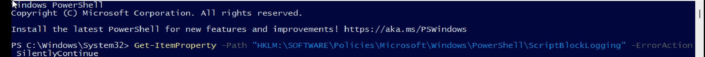

## Step 2 Enable Script Block Logging

The policy registry key was created and `EnableScriptBlockLogging` was set to `1`, then verified.

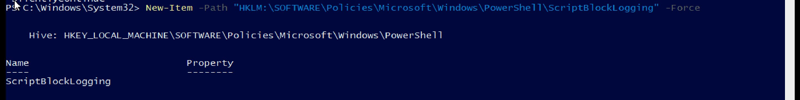
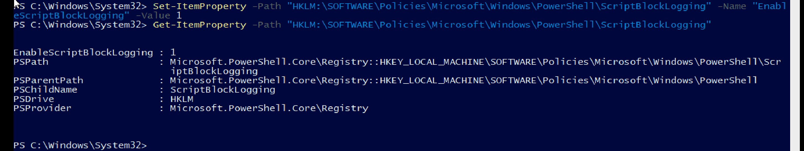

## Step 3 Baseline (Control): New-LocalUser cmdlet

```powershell
New-LocalUser -Name "test_baseline" -NoPassword
```

The account was created and enabled. The corresponding Event ID 4104 captured the command, and its `ScriptBlockText` contains the string `New-LocalUser`. The rule fires as expected, validating the test method.

**Result: DETECTED (control behaves correctly).**

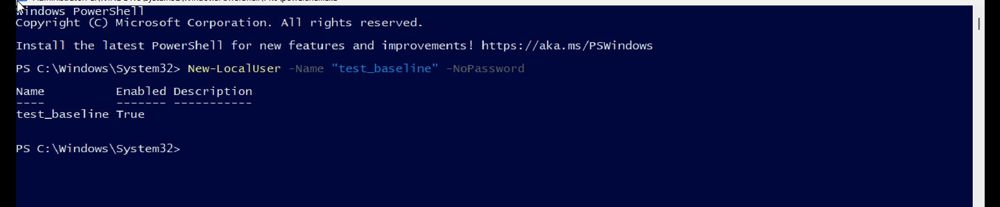
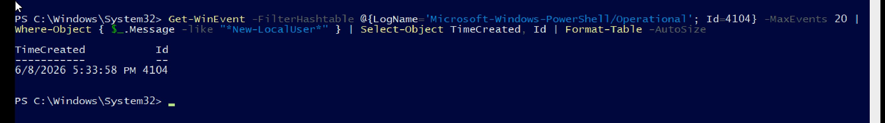

## Step 4 Evasion 1: ADSI / WinNT Provider

```powershell
$user = [ADSI]"WinNT://$env:COMPUTERNAME"; $newuser = $user.Create("User","test_adsi"); $newuser.SetInfo()
```

The account `test_adsi` was created, and `Get-LocalUser` confirms both it and the baseline account exist and are enabled.

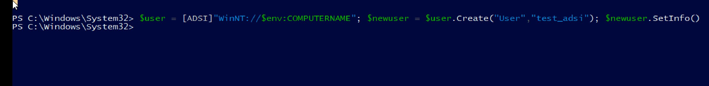
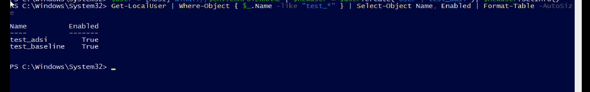

### Methodology Note (important)

The first attempt to verify evasion counted Event 4104 entries returned by a substring search for `New-LocalUser`. This approach was flawed: each search command itself contains the string `New-LocalUser` (inside the `Where-Object` filter), and Script Block Logging logs the search command too. The result was self-contamination the search was partly detecting itself rather than the user-creation commands. The screenshots below show the contaminated results, where repeated searches added their own entries to the count.

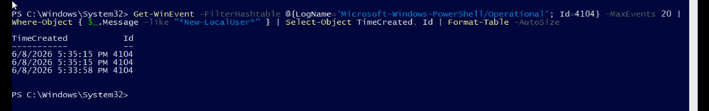
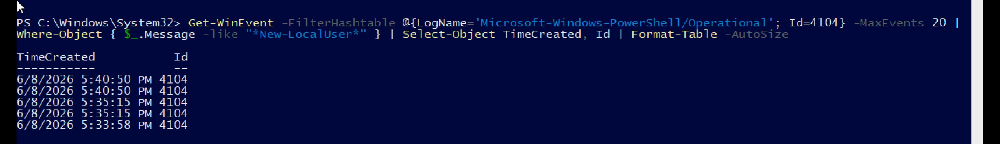

The method was corrected to read the full `ScriptBlockText` content of the specific user-creation event rather than counting events. This is immune to the contamination problem because it inspects the literal logged command. As an intermediate check, a search for the `WinNT` provider string confirmed the ADSI command was in fact logged:

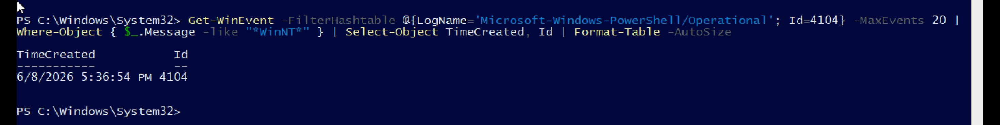

Recognising and correcting this flaw is documented here deliberately, as it is part of sound validation practice.

### Corrected Verification

Reading the literal captured `ScriptBlockText` of the ADSI event:

```
$user = [ADSI]"WinNT://$env:COMPUTERNAME"; $newuser = $user.Create("User","test_adsi"); $newuser.SetInfo()
```

The command was fully logged (Event ID 4104, 5:36:54 PM) but contains no instance of the string `New-LocalUser`. The rule does not match.

**Result: NOT DETECTED confirmed evasion.**

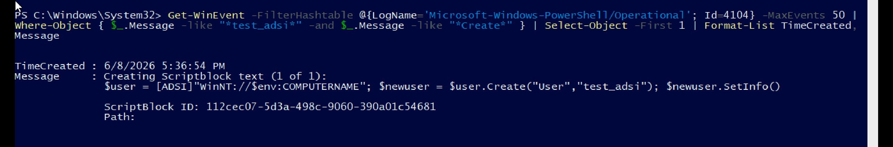

## Step 5 Evasion 2: net user

```powershell
net user test_netuser <password> /add
```

The account `test_netuser` was created successfully. Reading the captured `ScriptBlockText`:

```
net user test_netuser <password> /add
```

The command was logged (Event ID 4104, 5:46:51 PM) and again contains no instance of `New-LocalUser`. The rule does not match.

**Result: NOT DETECTED confirmed evasion (see Limitations).**

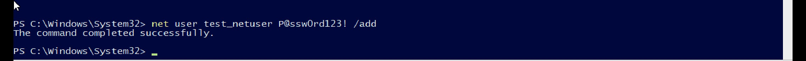
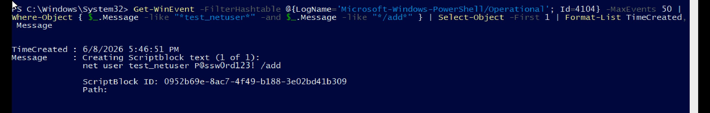

## Step 6 Cleanup

All three test accounts were removed and removal was verified (empty result).

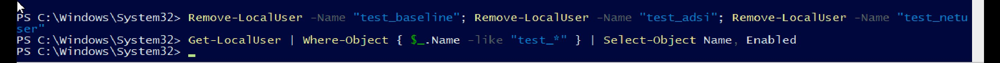

## Finding

The rule `posh_ps_create_local_user.yml` detects only the `New-LocalUser` cmdlet. Local account creation through the ADSI/WinNT provider produces a functionally identical result (a real, enabled local user) but is fully logged without the matched string, and therefore evades detection. This was confirmed by reading the literal captured `ScriptBlockText` of each command under a verified-active logging configuration, with a working control to validate the test method.

## Limitations

- The `net user` method, while it evades this script-block rule, may be detected in many environments through process-creation logging (Event ID 4688) on `net.exe`. It is therefore a weaker example. The ADSI/WinNT method is the cleaner gap, as it executes entirely in-process within PowerShell with no separate binary to catch.
- Testing was performed on a single Windows 11 / PowerShell 5.1 configuration. Behaviour was not validated against PowerShell 7.x or older Windows versions.
- This validation does not assess whether sibling rules elsewhere in the ruleset already cover the ADSI pattern.

## Recommendation

Consider broadening the detection to also cover the ADSI/WinNT account-creation pattern, for example by adding a selection matching `[ADSI]` together with `Create("User"` (or `Create('User'`) in the `ScriptBlockText`. A follow-up pull request could add this coverage if the maintainers consider it in scope.

## Repository Structure

```
sigma-rule-validation-create-local-user/
├── README.md
└── screenshots/
    ├── 01_scriptblock_logging_disabled_baseline.png
    ├── 02_scriptblock_logging_key_created.png
    ├── 03_scriptblock_logging_enabled_confirmed.png
    ├── 04_baseline_newlocaluser_created.png
    ├── 05_baseline_4104_newlocaluser_logged.png
    ├── 06_evasion_adsi_user_created.png
    ├── 07_both_test_users_exist.png
    ├── 08_contaminated_search_newlocaluser.png
    ├── 09_adsi_winnt_event_logged.png
    ├── 10_contamination_demonstrated.png
    ├── 11_adsi_message_content_no_newlocaluser.png
    ├── 12_evasion_netuser_created.png
    ├── 13_netuser_message_content_no_newlocaluser.png
    └── 14_test_users_removed_cleanup.png
```

## References

- Rule under test: https://github.com/SigmaHQ/sigma/blob/master/rules/windows/powershell/powershell_script/posh_ps_create_local_user.yml
- Sigma specification (modifiers; default string matching is case-insensitive): https://github.com/SigmaHQ/sigma-specification/blob/main/specification/sigma-appendix-modifiers.md
- Microsoft ADSI WinNT provider documentation: https://learn.microsoft.com/en-us/windows/win32/adsi/the-winnt-provider

---

*Validated and documented by [WiLL75G](https://github.com/WiLL75G).*
